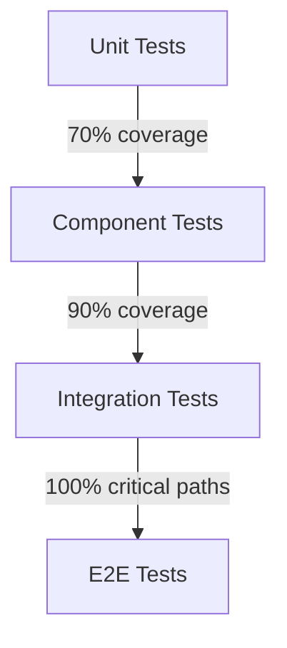

# WhatsApp Summarizer - Testing Strategy

## Overview
This document outlines the testing approach for the WhatsApp Summarizer application, ensuring high quality and reliability across all components.

## Testing Pyramid

## Test Types

### 1. Unit Tests
- **Purpose**: Test individual functions and components in isolation
- **Tools**: Jest, React Testing Library
- **Coverage Target**: 70%+
- **Location**: `tests/unit/`

### 2. Component Tests
- **Purpose**: Test React components in isolation
- **Tools**: React Testing Library, Storybook
- **Coverage**: Key user interactions
- **Location**: `tests/components/`

### 3. Integration Tests
- **Purpose**: Test interactions between components and services
- **Tools**: Jest, MSW (Mock Service Worker)
- **Coverage**: Critical user flows
- **Location**: `tests/integration/`

### 4. E2E Tests
- **Purpose**: Test complete user flows
- **Tools**: Playwright
- **Coverage**: Critical paths
- **Location**: `tests/e2e/`

### 5. Performance Tests
- **Purpose**: Ensure application performance
- **Tools**: Lighthouse, Web Vitals
- **Metrics**: FCP, LCP, CLS, TTI
- **Location**: `tests/performance/`

## Test Data Management

### Test Data Generation
- Use Faker.js for realistic test data
- Maintain seed data for consistent tests
- Clean up after tests

### Mocking Strategy
- Mock external services
- Use MSW for API mocking
- Mock time-dependent functions

## Test Automation

### CI/CD Pipeline
- Run tests on every push
- Block deployment on test failures
- Generate coverage reports

### Test Environments
1. **Local**: For development
2. **Staging**: Pre-production testing
3. **Production**: Smoke tests only

## Testing Scenarios

### Authentication
- Registration flow
- Login/logout
- Password reset
- Session management

### Chat Management
- Uploading chat files
- Viewing chat history
- Deleting chats
- Searching chats

### Summarization
- Text summarization
- Date range filtering
- Export functionality
- Error handling

## Performance Testing

### Load Testing
- Simulate concurrent users
- Measure response times
- Identify bottlenecks

### Stress Testing
- Test beyond normal load
- Monitor system recovery
- Check error handling

## Security Testing

### OWASP Top 10
- SQL Injection
- XSS
- CSRF
- Authentication bypass
- Sensitive data exposure

### Penetration Testing
- Regular security audits
- Third-party assessments
- Bug bounty program

## Accessibility Testing
- WCAG 2.1 AA compliance
- Keyboard navigation
- Screen reader testing
- Color contrast verification

## Testing Tools

| Category | Tools |
|----------|-------|
| Unit Testing | Jest, React Testing Library |
| E2E Testing | Playwright |
| API Testing | Postman, MSW |
| Performance | Lighthouse, Web Vitals |
| Security | OWASP ZAP, npm audit |
| Accessibility | axe, WAVE |
| Visual Regression | Percy, Chromatic |

## Test Reporting
- HTML coverage reports
- JUnit XML for CI integration
- Slack notifications for failures
- Historical trend analysis

## Test Maintenance
- Regular test updates
- Remove flaky tests
- Update test data
- Review test coverage

## Quality Gates
- 80%+ unit test coverage
- All critical tests must pass
- No high-severity vulnerabilities
- Performance budgets met
