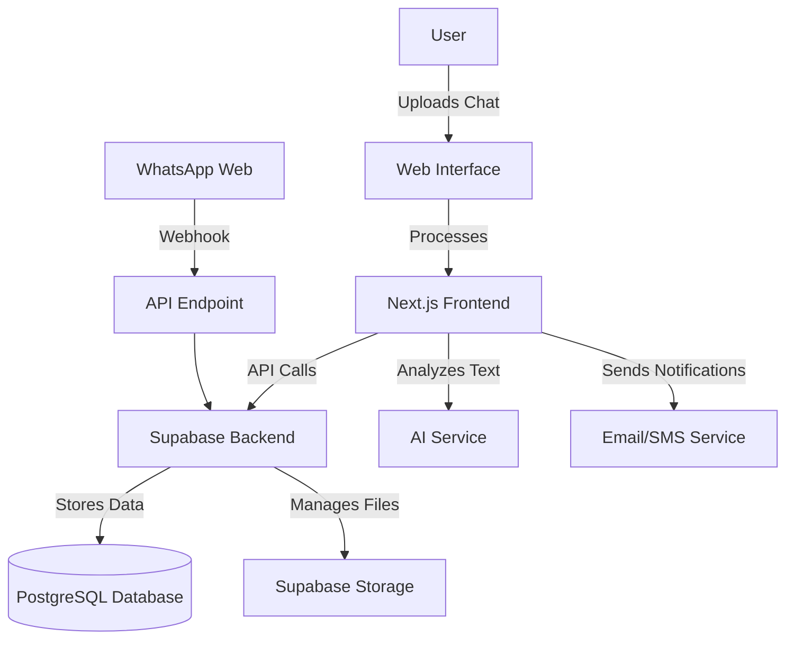

# WhatsApp Summarizer - System Architecture

## High-Level Overview

## Component Breakdown

### 1. Frontend (Next.js)
- **Pages & Routing**: App Router for client-side navigation
- **UI Components**: Reusable React components with Tailwind CSS
- **State Management**: React Context + SWR for data fetching
- **Authentication**: Supabase Auth UI components
- **Real-time Updates**: Supabase Realtime subscriptions

### 2. Backend (Supabase)
- **Authentication**: Email/Password, OAuth providers
- **Database**: PostgreSQL with Row Level Security
- **Storage**: For media files and chat exports
- **Edge Functions**: For serverless API endpoints
- **Realtime**: WebSocket connections for live updates

### 3. External Services
- **AI Service**: For text summarization
- **WhatsApp API**: For message retrieval
- **Email/SMS**: For notifications

## Data Flow

1. User uploads WhatsApp chat export
2. Frontend processes file and sends to backend
3. Backend stores raw data and triggers analysis
4. AI service processes and summarizes conversations
5. Results are stored and pushed to frontend in real-time
6. User views and interacts with summaries

## Security Considerations

- All database access uses Row Level Security (RLS)
- File uploads are scanned for malware
- API routes are protected with JWT verification
- Sensitive data is encrypted at rest
- Regular security audits and dependency updates

## Scaling Strategy

- Horizontal scaling of Next.js frontend
- Database read replicas for high-traffic scenarios
- Caching layer for frequent queries
- CDN for static assets and media
- Queue system for background processing

## Monitoring & Observability

- Logging of all critical operations
- Performance metrics collection
- Error tracking and reporting
- Usage analytics
- Uptime monitoring

## Deployment

- Vercel for frontend deployment
- Supabase for backend services
- CI/CD pipeline for automated testing and deployment
- Environment-specific configurations
- Automated backups

## Future Considerations

- Multi-language support
- Mobile app development
- Advanced analytics dashboard
- Integration with other messaging platforms
- Offline support with service workers
